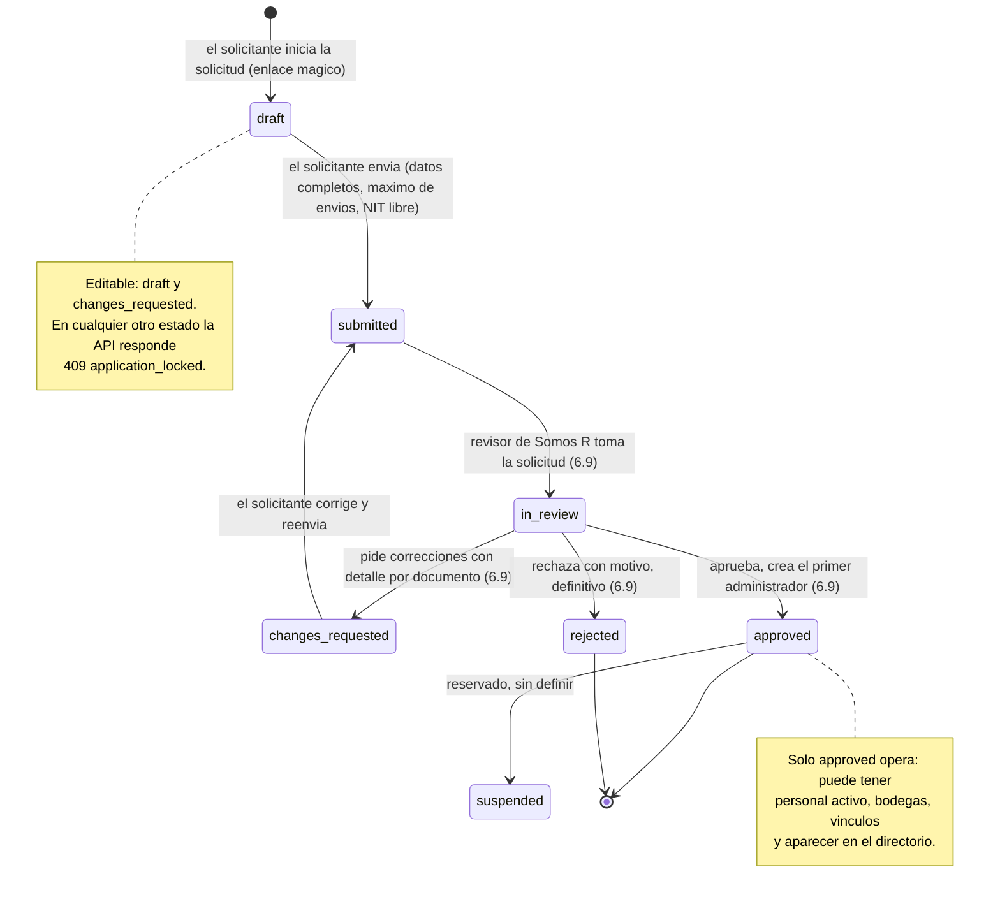
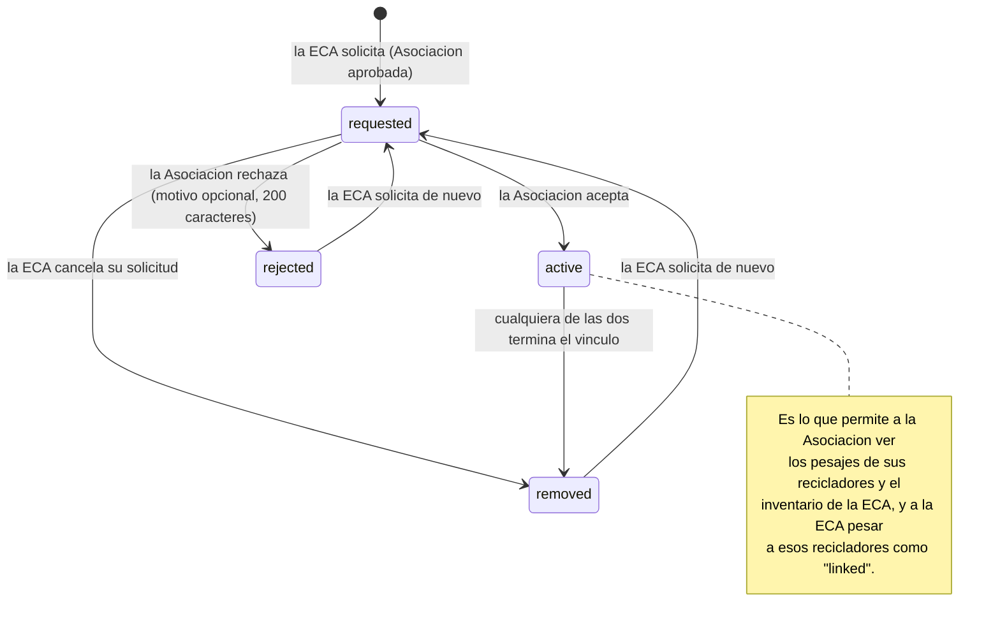
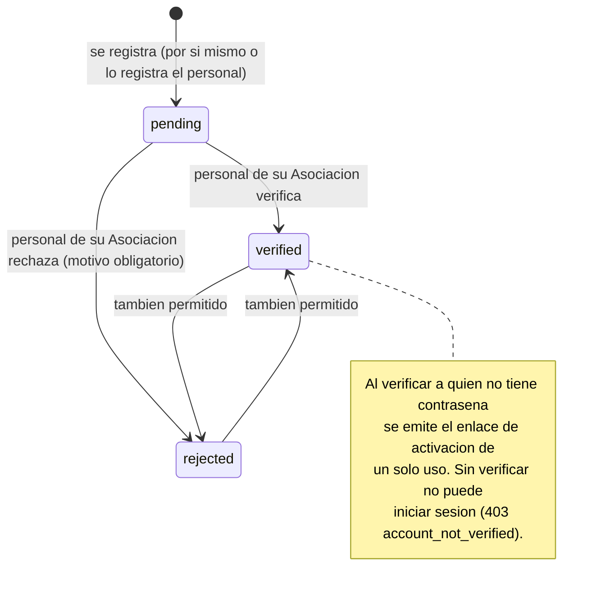
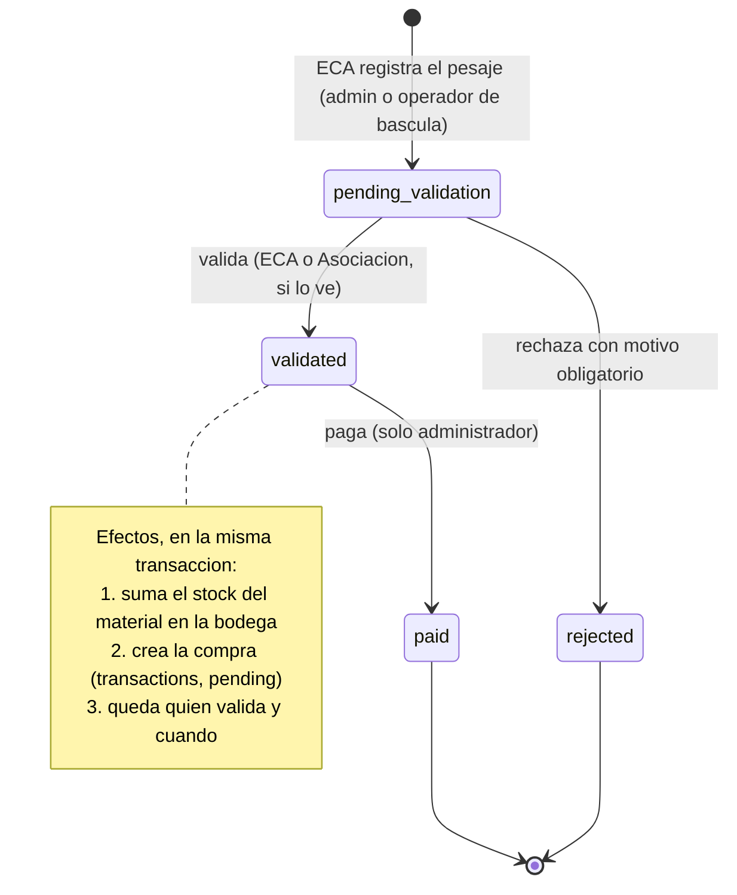
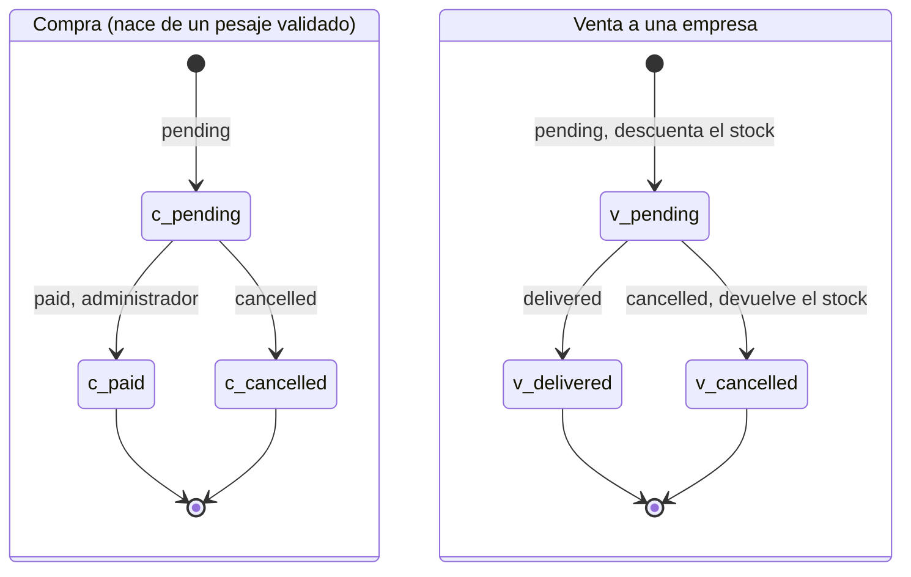
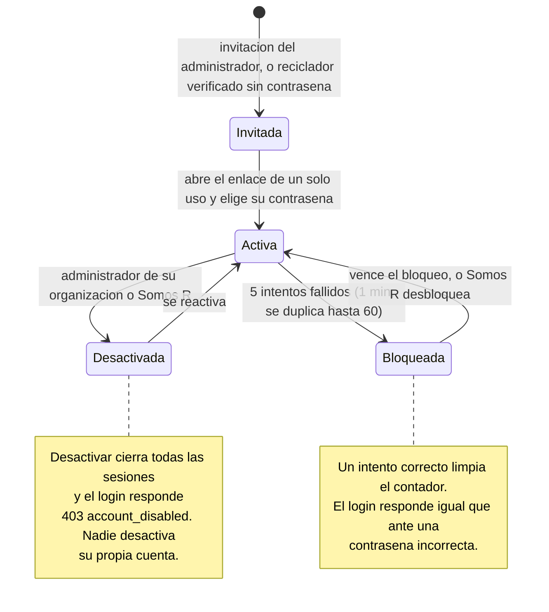

# Diagramas de estados

Los seis objetos de Somos R que cambian de estado, con **quién** dispara cada cambio, **qué efectos** tiene y **qué rechaza el backend**. Reflejan `main` a 3 de octubre de 2026. Lo que está diseñado pero aún no existe se marca como *pendiente* y se dibuja con línea punteada o en una nota.

Cómo leerlos: una flecha es una transición permitida; el texto dice quién la hace. Un estado sin flechas de salida es final. Cualquier otra transición responde `400 invalid_transition` (o `409` en vínculos).

Los estados salen de los enumerados del [modelo de datos](modelo-de-datos.md); las reglas de quién puede hacer cada cosa, de la [matriz de permisos](matriz-permisos.md).

---

## 1. Solicitud de organización (`organizations.status`)

Cómo una Asociación o una ECA llega a operar. Solo la parte pública (`draft` → `submitted`) existe; la revisión es la tarea 6.9.

- **Hoy** las organizaciones demo se crean con `scripts/seed_demo.py` (nacen `approved`). Las que ya existían al migrar (0018) también nacieron `approved`.
- **Reglas al enviar:** faltan datos → `422 application_incomplete`; se alcanzó el máximo de envíos → `409 too_many_submissions`; ya existe una organización que opera con ese NIT → `409 organization_already_registered`.
- **El NIT único** solo cuenta entre organizaciones `approved` o `suspended`: un borrador no bloquea a la organización real.

---

## 2. Vínculo ECA ↔ Asociación (`eca_association_links.status`)

La ECA siempre inicia y la Asociación decide. Es una sola fila por pareja: volver a solicitar la reabre.

- **Rechazos del backend:** pedir un vínculo ya pendiente → `409 link_already_requested`; ya activo → `409 link_already_active`; decidir uno que no está pendiente → `409 link_not_pending`; retirar uno en otro estado, o una Asociación retirando un pendiente → `409 link_not_removable`; una organización no aprobada → `409 organization_not_active`.
- **Efecto al terminar:** el historial de pesajes `linked` no se pierde, pero los pesajes nuevos de esos recicladores dejan de ser `linked`.
- La historia completa de cada vínculo queda en la auditoría (`link.requested`, `accepted`, `rejected`, `removed`).

---

## 3. Verificación del reciclador (`users.verification_status`)

La Asociación a la que pertenece el reciclador decide si entra al padrón.

- **Quién:** `association_admin` y `association_operator`, solo sobre recicladores de **su** asociación (los demás responden 404). La ECA no verifica.
- **Observación:** el backend **no restringe la transición**: cualquier estado puede pasar a cualquier otro (rechazar exige motivo). Volver a `pending` es posible por API. Conviene confirmar si `verified` → `rejected` debe permitirse.
- **El pesaje no exige verificación:** una ECA recibe a cualquier reciclador. La verificación solo decide si el pesaje cuenta como `linked` (ver el [flujo de negocio](flujo-de-negocio.md)).

---

## 4. Pesaje (`weighings.status`)

- **Quién:** registra `eca_admin` y `eca_operator`, solo en bodegas de su ECA. Valida o rechaza `eca_admin`, `eca_operator`, `association_admin` y `association_operator`. Paga solo el administrador de cada organización. Una Asociación solo ve y decide sobre pesajes `linked` de sus recicladores.
- **Es irreversible:** no hay corrección ni anulación de un pesaje validado o pagado. El rediseño con correcciones como registros nuevos es la tarea 7.2.
- **Rechazos del backend:** validar o rechazar fuera de `pending_validation`, o pagar fuera de `validated` → `400 invalid_transition`; rechazar sin motivo → `400 rejection_reason_required`; reciclador desactivado → `400 recycler_inactive`; material o bodega inactivos → `400`.
- **Concurrencia:** la transición bloquea la fila (`FOR UPDATE`), así que dos validaciones simultáneas no duplican stock ni compra.

---

## 5. Transacción (`transactions.status`)

Hay dos tipos y sus ciclos son distintos.

| | Compra | Venta |
|---|---|---|
| Nace | sola, al validar un pesaje (una por pesaje) | la registra `eca_admin` o `eca_warehouse` con comprador y precio |
| Efecto de crear | ninguno (el stock ya sumó al validar) | **resta** el stock; sin stock suficiente se rechaza |
| `paid` | sí, solo administradores | no existe |
| `delivered` | no existe | sí, `eca_admin` y `eca_warehouse` |
| `cancelled` | permitido, **sin efecto sobre stock ni pesaje** | devuelve el stock sin cambiar el precio de referencia |

- **Dos "pagado" independientes:** pagar un pesaje (`weighings.paid`) **no** marca su compra como pagada, ni al revés. Hoy son dos registros que alguien debe actualizar. Conviene decidir si deben moverse juntos.
- **Cancelar una compra** no devuelve el stock que sumó el pesaje ni cambia el pesaje, que sigue `validated`. Conviene confirmar con negocio si debe permitirse.
- Una compra o venta fuera de `pending` no cambia más: `400 invalid_transition`.

---

## 6. Cuenta de usuario

No es una columna sino la combinación de `password_hash`, `is_active` y `locked_until`. Es lo que el usuario experimenta al entrar.

- **Recicladores:** además de estar activa, la cuenta debe estar `verified` para iniciar sesión (`403 account_not_verified`). Ver el diagrama 3.
- **Somos R (`platform_admin`):** no entra por el login público. En el backoffice el acceso exige además TOTP, y sus intentos fallidos no bloquean la cuenta por el endpoint público.
- **Qué cierra sesiones:** desactivar, cambiar la contraseña y la acción "cerrar sesiones" del backoffice. Reusar un refresh token ya rotado revoca toda su familia.

---

## Lo que estos diagramas dejan ver

Resumen de los puntos a decidir que aparecieron al dibujarlos:

1. **Pesaje pagado y compra pagada son independientes.** ¿Deben moverse juntos?
2. **Cancelar una compra no revierte el stock ni el pesaje.** ¿Debe permitirse?
3. **La verificación del reciclador admite cualquier salto**, incluso volver a `pending`. ¿Debe restringirse?
4. **Un pesaje validado o pagado no se puede corregir.** Lo resuelve la tarea 7.2.
5. **`suspended` no tiene transiciones definidas**: falta decidir la revalidación de organizaciones.
