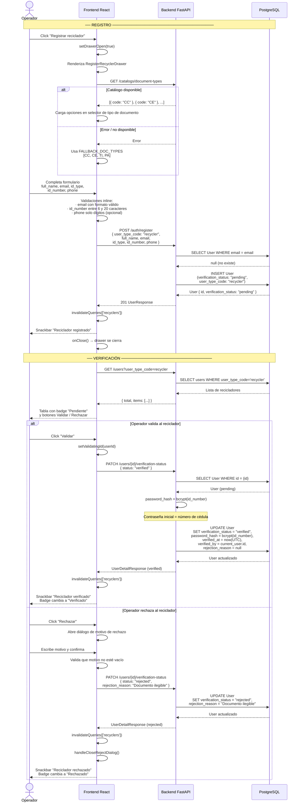
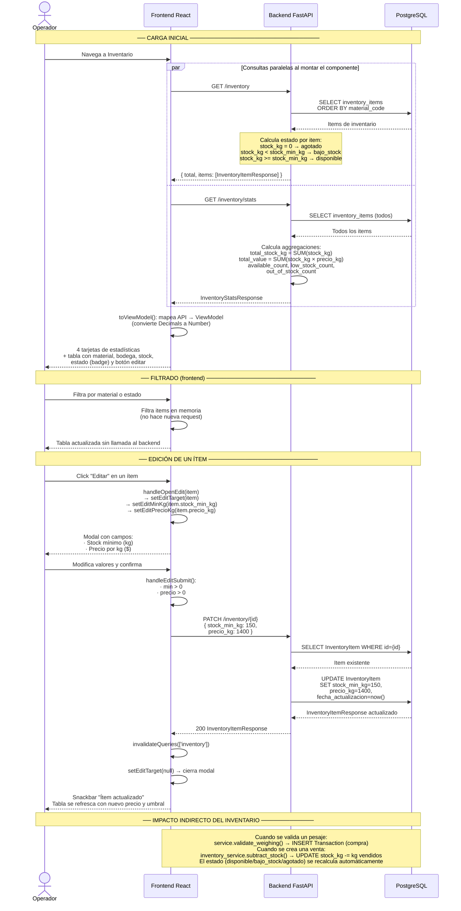

# Diagramas de Secuencia por Módulo

Cada diagrama es independiente y cubre un módulo específico del sistema.

---

## 1. Recicladores — Registro y Verificación

---

## 2. Pesajes — Registro y Validación

```mermaid
sequenceDiagram
    actor Operador
    participant FE as Frontend React
    participant API as Backend FastAPI
    participant DB as PostgreSQL

    Note over Operador,DB: ── CARGA INICIAL DE LA PÁGINA ───────────────────

    Operador->>FE: Navega a Pesajes
    par Consultas paralelas
        FE->>API: GET /weighings?limit=20
        API->>DB: SELECT weighings ORDER BY fecha DESC
        DB-->>API: Lista de pesajes
        API-->>FE: { total, items: [...] }
    and
        FE->>API: GET /weighings/stats
        API->>DB: SELECT weighings WHERE fecha >= inicio_mes
        DB-->>API: Aggregaciones del mes
        API-->>FE: { total_weighings_month,<br/>  total_kg_month,<br/>  pending_count,<br/>  by_material: [...] }
    end
    FE-->>Operador: Tabla de pesajes + tarjetas de estadísticas

    Note over Operador,DB: ── REGISTRO DE PESAJE ───────────────────────────

    Operador->>FE: Click "Nuevo pesaje"
    FE->>FE: setDrawerOpen(true)

    par Carga paralela al abrir drawer (enabled: open)
        FE->>API: GET /users?verification_status=verified
        API->>DB: SELECT users WHERE verification_status='verified'
        DB-->>API: Recicladores verificados
        API-->>FE: { items: [recicladores] }
        Note over FE: Solo recicladores verificados<br/>aparecen en el selector
    and
        FE->>API: GET /inventory/materials
        API->>DB: SELECT materials WHERE is_active=true
        DB-->>API: Catálogo de materiales
        API-->>FE: [{ code, label }]
    and
        FE->>API: GET /inventory/warehouses
        API->>DB: SELECT warehouses WHERE is_active=true
        DB-->>API: Bodegas activas
        API-->>FE: [{ id, name }]
    and
        FE->>API: GET /inventory
        API->>DB: SELECT inventory_items
        DB-->>API: Items con precio_kg por material+bodega
        API-->>FE: { items: [...] }
    end

    Operador->>FE: Selecciona reciclador de la lista
    Operador->>FE: Selecciona material + bodega

    FE->>FE: useEffect: busca en inventoryItems<br/>match(material_code + warehouse_id)
    FE->>FE: Auto-completa precio_kg<br/>con el precio del inventario

    Operador->>FE: Ajusta kg (y precio si necesario)
    FE->>FE: Muestra total = kg × precio_kg en tiempo real

    Operador->>FE: Click "Registrar pesaje"
    FE->>FE: validate():<br/>· recycler_id no vacío<br/>· material_code no vacío<br/>· warehouse_id no vacío<br/>· kg > 0<br/>· precio_kg > 0

    FE->>API: POST /weighings<br/>{ recycler_id, material_code,<br/>  warehouse_id, kg, precio_kg }

    API->>DB: GET User(recycler_id)<br/>→ valida user_type_code='recycler'
    API->>DB: GET Material(material_code)
    API->>DB: GET Warehouse(warehouse_id)
    DB-->>API: Entidades válidas

    API->>DB: INSERT Weighing<br/>(estado: pendiente, fecha: now())
    DB-->>API: Weighing { id, estado: "pendiente" }

    API-->>FE: 201 WeighingResponse
    FE->>FE: invalidateQueries(['weighings'])
    FE-->>Operador: Snackbar "Pesaje registrado"
    FE->>FE: onClose()

    Note over Operador,DB: ── VALIDACIÓN / RECHAZO ─────────────────────────

    Operador->>FE: Click "Validar" en pesaje pendiente
    FE->>API: PATCH /weighings/{id}/status<br/>{ status: "validado" }

    API->>DB: SELECT Weighing WHERE id={id}
    DB-->>API: Weighing (pendiente)

    API->>DB: UPDATE Weighing<br/>SET estado='validado',<br/>    validated_by=current_user.id

    Note over API,DB: Service crea la transacción de compra automáticamente
    API->>DB: INSERT Transaction<br/>(type: "compra",<br/> status: "pendiente",<br/> recycler_id, material_code,<br/> warehouse_id, kg, precio_kg,<br/> total_value = kg × precio_kg)
    DB-->>API: Transaction creada

    API-->>FE: WeighingResponse (validado)
    FE->>FE: invalidateQueries(['weighings','transactions'])
    FE-->>Operador: Badge "Validado" en la fila

    alt Rechazo en lugar de validación
        Operador->>FE: Click "Rechazar" → ingresa motivo
        FE->>API: PATCH /weighings/{id}/status<br/>{ status: "rechazado",<br/>  rejection_reason: "Peso inconsistente" }
        API->>DB: UPDATE Weighing<br/>SET estado='rechazado',<br/>    rejection_reason='Peso inconsistente'
        DB-->>API: OK
        API-->>FE: WeighingResponse (rechazado)
        FE-->>Operador: Badge "Rechazado" en la fila
    end
```

---

## 3. Inventario — Consulta y Edición

---

## 4. Transacciones — Compras y Ventas

```mermaid
sequenceDiagram
    actor Operador
    participant FE as Frontend React
    participant API as Backend FastAPI
    participant DB as PostgreSQL

    Note over Operador,DB: ── CARGA INICIAL ────────────────────────────────

    Operador->>FE: Navega a Transacciones

    par Consultas paralelas
        FE->>API: GET /transactions?type=compra&limit=100
        API->>DB: SELECT transactions WHERE type='compra'<br/>ORDER BY fecha DESC
        DB-->>API: Lista de compras
        API-->>FE: { total, items: [compras] }
    and
        FE->>API: GET /transactions?type=venta&limit=100
        API->>DB: SELECT transactions WHERE type='venta'
        DB-->>API: Lista de ventas
        API-->>FE: { total, items: [ventas] }
    and
        FE->>API: GET /transactions/stats
        API->>DB: SELECT transactions WHERE fecha >= inicio_mes
        DB-->>API: Transacciones del mes
        API->>API: Calcula: kg compras/ventas,<br/>valor total, pendientes
        API-->>FE: TransactionStatsResponse
    and
        FE->>API: GET /inventory/warehouses
        API-->>FE: [{ id, name }]
        Note over FE: Usadas para pre-seleccionar<br/>bodega en "Nueva Venta"
    end

    FE-->>Operador: Pestaña Compras + pestaña Ventas<br/>con tarjetas de estadísticas y tablas

    Note over Operador,DB: ── CREAR VENTA MANUAL ───────────────────────────

    Operador->>FE: Click "Nueva Venta"
    FE->>FE: setVentaForm({<br/>  ...EMPTY_VENTA,<br/>  warehouse_id: warehouses[0].id<br/>})
    Note over FE: Primera bodega pre-seleccionada<br/>para evitar validación vacía
    FE-->>Operador: Modal con campos:<br/>material, bodega, kg,<br/>precio_kg, empresa compradora

    Operador->>FE: Completa datos y confirma
    FE->>FE: Valida warehouse_id, kg, precio_kg no vacíos

    FE->>API: POST /transactions<br/>{ material_code, warehouse_id,<br/>  kg, precio_kg, buyer_name,<br/>  buyer_nit, buyer_email }

    API->>DB: GET Material, GET Warehouse → valida existencia
    DB-->>API: OK

    API->>DB: subtract_stock()<br/>UPDATE InventoryItem SET stock_kg -= kg

    alt Stock insuficiente
        API-->>FE: 400 "Stock insuficiente:<br/>disponible X kg, solicitado Y kg"
        FE-->>Operador: Alert con el error
    else Stock disponible
        API->>DB: INSERT Transaction<br/>(type: "venta", status: "pendiente",<br/> total_value = kg × precio_kg)
        DB-->>API: Transaction { id, status: "pendiente" }
        API-->>FE: 201 TransactionResponse
        FE->>FE: invalidateQueries(['transactions','inventory','weighings'])
        FE->>FE: setShowVentaModal(false)
        FE-->>Operador: Venta aparece en tabla con botones<br/>"Marcar entregada" / "Cancelar"
    end

    Note over Operador,DB: ── ENTREGAR O CANCELAR VENTA ────────────────────

    Operador->>FE: Click "Marcar entregada" en venta pendiente
    FE->>API: PATCH /transactions/{id}/status<br/>{ status: "entregado" }
    API->>API: Verifica type=venta, status=pendiente
    API->>DB: UPDATE Transaction SET status = "entregado"
    DB-->>API: OK
    API-->>FE: TransactionResponse (entregado)
    FE->>FE: invalidateQueries(['transactions'])
    FE-->>Operador: Tabla actualiza estado

    Operador->>FE: Click "Cancelar" en venta pendiente
    FE->>API: PATCH /transactions/{id}/status<br/>{ status: "cancelado" }
    API->>API: Verifica status=pendiente
    API->>DB: add_stock()<br/>UPDATE InventoryItem SET stock_kg += kg<br/>(se restaura el stock descontado al crear)
    API->>DB: UPDATE Transaction SET status = "cancelado"
    DB-->>API: OK
    API-->>FE: TransactionResponse (cancelado)
    FE->>FE: invalidateQueries(['transactions','inventory'])
    FE-->>Operador: Tabla actualiza estado, stock restaurado

    Note over Operador,DB: ── MARCAR COMPRA COMO PAGADA (pago manual) ──────

    Operador->>FE: Click "Marcar pagada" en compra pendiente
    FE->>API: PATCH /transactions/{id}/status<br/>{ status: "pagado" }
    API->>API: Verifica type=compra, status=pendiente
    API->>DB: UPDATE Transaction SET status = "pagado"
    DB-->>API: OK
    API-->>FE: TransactionResponse (pagado)
    FE->>FE: invalidateQueries(['transactions'])
    FE-->>Operador: Tabla actualiza estado
```

