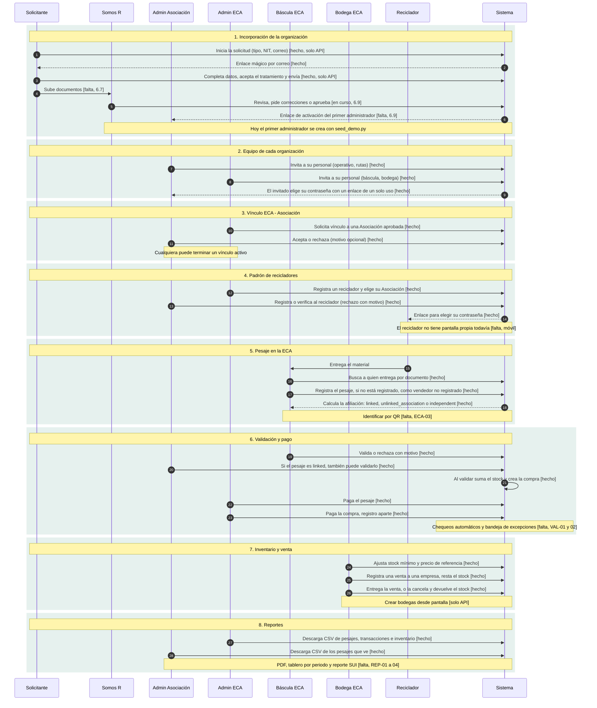
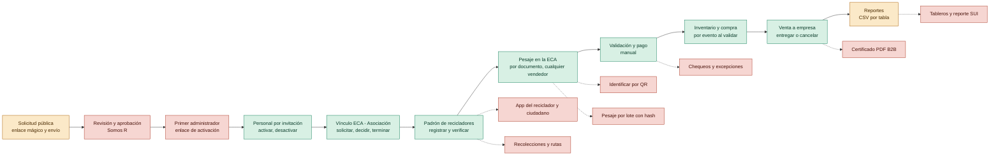
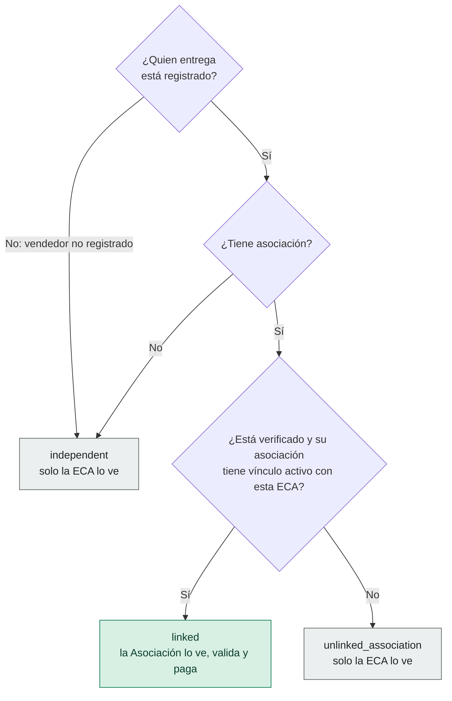

# Flujo de negocio de punta a punta

Cómo se conectan los actores de Somos R, desde que una organización pide entrar hasta que el material pesado queda en inventario y se vende. Reemplaza a las secuencias por módulo de los sprints 2 y 3, que son anteriores a las organizaciones, a los vínculos y a "la ECA recibe de cualquiera". Estado de `main` a 3 de octubre de 2026.

Cada paso lleva una etiqueta: **[hecho]** existe en la API y en la pantalla que corresponde, **[solo API]** existe en el backend pero no tiene pantalla, **[en curso]** hay trabajo abierto, **[falta]** no existe todavía. Los estados de cada objeto están en [diagramas de estados](diagramas-de-estados.md).

## 1. El flujo, por carriles

Cada columna es un actor; las franjas son las etapas.

## 2. Qué parte del flujo existe

Misma ruta, vista por cobertura. Verde es lo que funciona hoy, ámbar lo que tiene una parte, rojo lo que falta.

Fuera del camino principal, sin empezar: solicitudes de recolección del ciudadano, motor de rutas, sincronización móvil sin conexión y módulo educativo (fases 3, 4 y parte de la 2 del backlog).

## 3. ¿A dónde llega este pesaje?

Una ECA recibe el material de quien lo traiga. Lo que cambia es si el pesaje llega a una Asociación. Se decide en el instante de pesar y queda guardado en `affiliation_status`.

- Los tres casos **cuentan para el inventario, las compras y los reportes de la ECA**. Solo `linked` llega a una Asociación (pesajes, compras y estadísticas).
- Un reciclador **desactivado por Somos R** sí se rechaza: `400 recycler_inactive`.
- **Pregunta abierta de negocio:** si el pesaje de un vendedor fuera del vínculo cuenta para el reporte SUI de la ECA, de la asociación de origen o de ambas.

## 4. Quién hace qué, en una línea

| Actor | Lo que hace en este flujo |
|---|---|
| Solicitante | Pide el ingreso de su organización y corrige lo que Somos R observe |
| Somos R | Revisa y aprueba organizaciones, gestiona usuarios y catálogos, audita |
| Admin de Asociación | Decide vínculos, verifica recicladores, valida y paga lo de sus recicladores `linked` |
| Admin de ECA | Solicita vínculos, invita personal, paga pesajes y compras, vende, ve todo lo de sus bodegas |
| Báscula (ECA) | Identifica, pesa, valida y rechaza |
| Bodega (ECA) | Edita inventario y gestiona ventas |
| Reciclador | Entrega el material; todavía sin pantalla propia |
