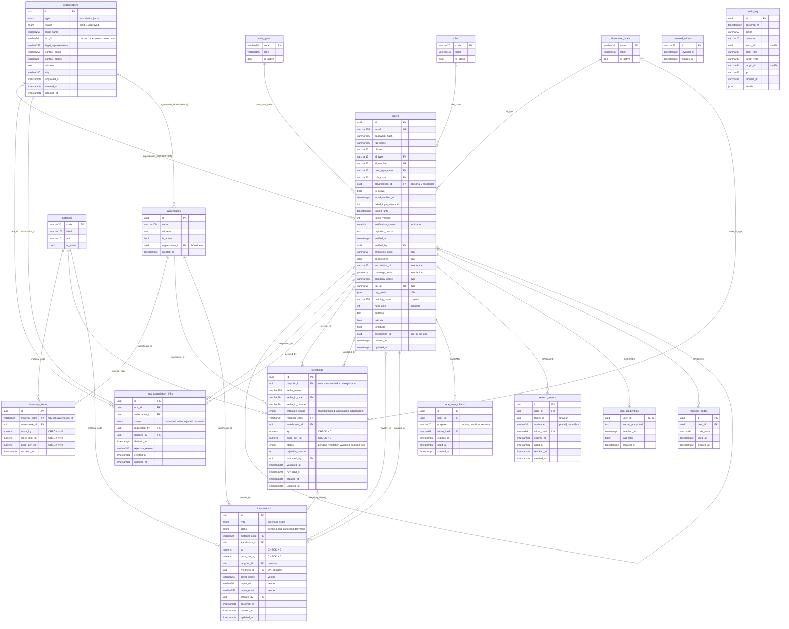
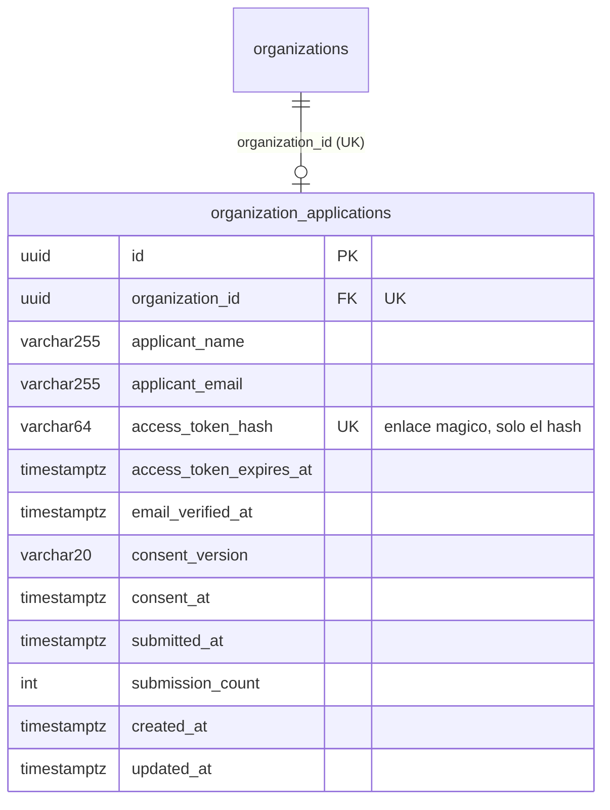

# Modelo de datos (MER)

Estado de la base de datos en `main`, migración **0022**. Verificado contra una base real con las migraciones aplicadas (tablas, columnas y llaves foráneas con su regla de borrado). GitHub dibuja el diagrama; en otro editor, pegar el bloque en <https://mermaid.live>.

Convenciones: `PK` llave primaria, `FK` llave foránea, `UK` única. Los tipos son los de PostgreSQL simplificados; `enum` indica un tipo enumerado (valores en la sección *Enumerados*).

## Diagrama

## Lectura del modelo

**Cuatro bloques**

1. **Identidad y organizaciones:** `users` (una sola tabla para todos los actores, con columnas propias de cada tipo), los catálogos `user_types`, `roles` y `document_types`, `organizations` (la Asociación o la ECA como entidad) y `eca_association_links` (relación de varios a varios, siempre iniciada por la ECA).
2. **Operación:** `warehouses` (de una ECA), `materials`, `inventory_items` (stock por material y bodega), `weighings` y `transactions`.
3. **Sesión y seguridad:** `one_time_tokens` (activar, verificar correo, restablecer), `refresh_tokens` (con familia, para detectar reuso), `revoked_tokens`, `mfa_credentials` y `recovery_codes` (solo Somos R).
4. **Auditoría:** `audit_log`, sin llaves foráneas a propósito: un registro debe sobrevivir al usuario o recurso que describe.

**Cómo se decide quién ve qué (alcance por organización)**

- El personal y el reciclador pertenecen a **una** organización (`users.organization_id`).
- Los datos operativos pertenecen a la **ECA dueña de la bodega** (`warehouses.organization_id`): inventario, pesajes y transacciones heredan el alcance por `warehouse_id`.
- Una **Asociación** lee los pesajes de sus recicladores solo si `affiliation_status = linked`, y el inventario de las ECA con un vínculo `active`.
- Una bodega sin dueña (`organization_id` nulo) no la ve ningún cliente.

**Reglas de integridad en la base**

- `inventory_items`: único por `(material_code, warehouse_id)`; stock, mínimo y precio no negativos.
- `weighings` y `transactions`: `kg > 0` y `price_per_kg > 0`; una compra por pesaje (`weighing_id` único).
- Un pesaje tiene **un** vendedor: un `recycler_id` o los datos del vendedor no registrado (restricción `CHECK` en `weighings`).
- `organizations`: un NIT por tipo de organización (índice único parcial). `users.organization_id` y `warehouses.organization_id` son `RESTRICT`: una organización con personal o bodegas no se borra.
- Los tokens y credenciales MFA se borran en cascada con su usuario.

## Enumerados

| Enumerado | Valores |
|---|---|
| `organization_type` | `association`, `eca` |
| `organization_status` | `draft`, `submitted`, `in_review`, `changes_requested`, `approved`, `rejected`, `suspended` (solo `approved` opera) |
| `link_status` | `requested`, `active`, `rejected`, `removed` |
| `weighing_status` | `pending_validation`, `validated`, `paid`, `rejected` |
| `affiliation_status` | `linked`, `unlinked_association`, `independent` |
| `transaction_type` | `purchase`, `sale` |
| `transaction_status` | `pending`, `paid`, `cancelled`, `delivered` |
| `verification_status` (en `users`, smallint) | `pending`, `verified`, `rejected` |

## Observaciones de diseño

- **`users` es una tabla ancha** (39 columnas): mezcla campos de reciclador, ECA, Asociación, conjunto y B2B. La tarea 5.5 del plan de hardening la separa en identidad más perfiles por tipo con `CHECK`.
- **`users.association_id` es residual:** columna `uuid` sin llave foránea y sin uso en el código. La asociación de un reciclador vive en `organization_id`. Candidata a eliminarse en una migración.
- **Datos duplicados de la Asociación en `users`** (`association_nit`, `legal_representative`, `coverage_area`) conviven con `organizations`; la migración 0018 los usó para crear las organizaciones.
- **Sin libro de movimientos:** `inventory_items.stock_kg` es el único registro del stock. Las tareas 5.7 y 7.3 piden un libro inmutable de movimientos.
- **Un pesaje es un solo renglón** (un material, un peso). El rediseño por lote con hash encadenado es la tarea 7.2.
- **`audit_log.target_id` es texto** (admite ids de cualquier tipo de recurso), por eso no hay llave foránea.

## En curso: solicitud pública de organización (PR #60, migración 0023)

Aún no está en `main`. Agrega una tabla y cambia un índice de `organizations`.

- El NIT único de `organizations` pasa a contarse **solo entre organizaciones que operan** (`approved` o `suspended`): un borrador no debe bloquear a la organización real.
- Falta (tareas 6.7 a 6.9): `organization_document_types` y los documentos de cada solicitud, la revisión con su checklist y los motivos de rechazo.
